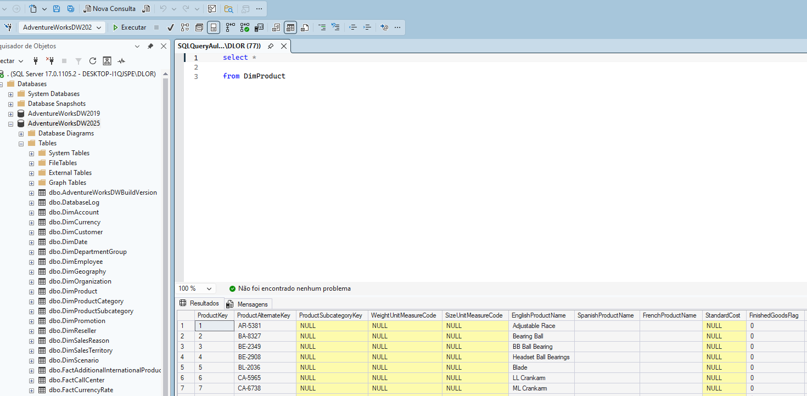
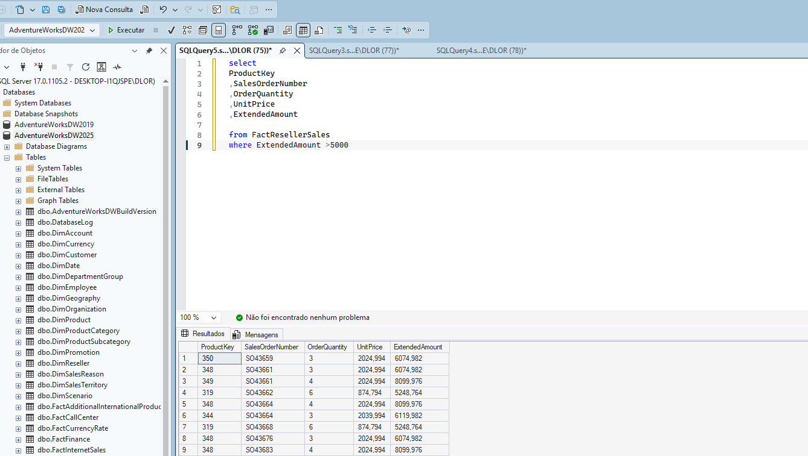
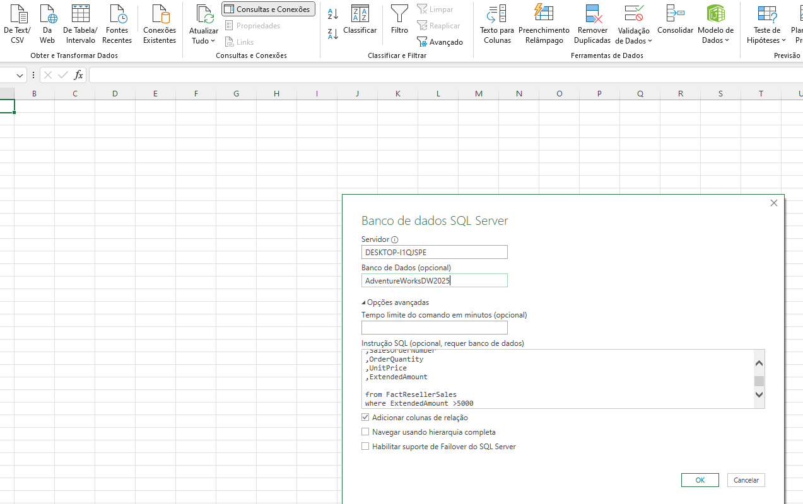
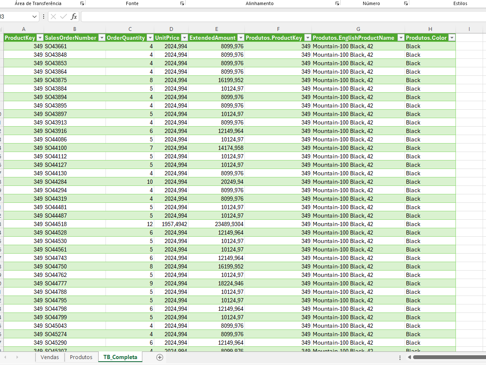
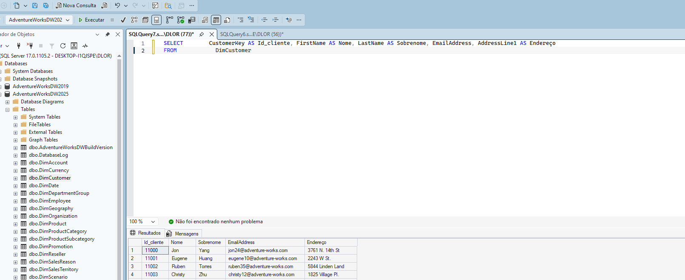

# 🗄️ SQL Server — Consultas e Vínculos

Repositório de estudos práticos sobre **Microsoft SQL Server**, utilizando o banco de dados **AdventureWorksDW2025**. Cobre consultas com filtros, vínculo de tabelas com Excel e renomeação de colunas.

---

## 📋 Sumário

- [Estrutura do Repositório](#-estrutura-do-repositório)
- [Como Usar](#-como-usar)
- [Conteúdo Estudado](#-conteúdo-estudado)
- [Roadmap de Estudos](#-roadmap-de-estudos)
- [Tecnologias](#-tecnologias)
- [Autor](#-autor)

---

## 📁 Estrutura do Repositório

```
sql-server-consultas-e-vinculos/
│
├── README.md
│
├── scripts/
│   ├── SQLQueryAula1.sql                      # SELECT básico
│   ├── SQLQueryAula2FactResellerSales.sql      # SELECT com WHERE
│   ├── SQLQueryAula2VinculoTabelas.sql         # Vínculo com Excel
│   └── SQLQueryAula3RenomeandoColunas.sql      # Renomear colunas com AS
│
└── imagens/
    ├── SQLQueryAula1.png
    ├── SQLQueryAula2FactResellerSales.png
    ├── SQLQueryAula2ConsultaPersonalizadaExcel.png
    ├── SQLQueryAula2VinculoTabelas.png
    └── SQLQueryAula3RenomeandoColunas.png
```

---

## 🚀 Como Usar

### Pré-requisitos

- [SQL Server 2019+](https://www.microsoft.com/pt-br/sql-server/sql-server-downloads)
- [SQL Server Management Studio (SSMS)](https://learn.microsoft.com/pt-br/sql/ssms/download-sql-server-management-studio-ssms)

### Executando os Scripts

1. Abra o arquivo `.sql` desejado no SSMS
2. Certifique-se de estar conectado ao banco **AdventureWorksDW2025**
3. Pressione `F5` ou clique em **Executar**

---

## 📖 Conteúdo Estudado

### Aula 1 — SELECT básico
Introdução ao `SELECT *` para retornar todos os dados de uma tabela.

```sql
SELECT *
FROM DimProduct
```



---

### Aula 2 — SELECT com WHERE
Uso do `WHERE` para filtrar registros, retornando apenas vendas com `ExtendedAmount` maior que 5000.

```sql
SELECT
     ProductKey
    ,SalesOrderNumber
    ,OrderQuantity
    ,UnitPrice
    ,ExtendedAmount
FROM FactResellerSales
WHERE ExtendedAmount > 5000
```



---

### Aula 2 — Vínculo de Tabelas com Excel
Consulta usada para conectar o SQL Server diretamente ao Excel, combinando dados de vendas com informações de produtos em uma tabela completa.

```sql
SELECT
     ProductKey
    ,EnglishProductName
    ,Color
FROM DimProduct
```




---

### Aula 3 — Renomeando Colunas com AS
Uso do `AS` para renomear colunas e tornar o resultado mais legível.

```sql
SELECT
     CustomerKey  AS Id_cliente
    ,FirstName    AS Nome
    ,LastName     AS Sobrenome
    ,EmailAddress
    ,AddressLine1 AS Endereço
FROM DimCustomer
```



---

## 🛠️ Tecnologias


---

## 👤 Autor

**Douglas Luiz de Oliveira Rodrigues**
[GitHub](https://github.com/Douglas-Luiz-de-Oliveira-Rodrigues)
